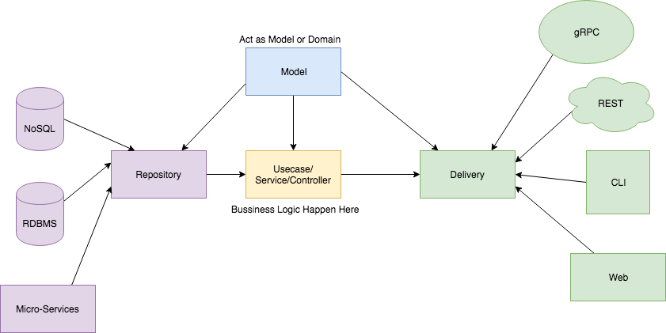

# Fluent   
Fluent是基于Akka-HTTP实现的一个HTTP服务框架。为Scala新手提供一个容易快速上手且功能全面的基础服务框架。

## Design Philosophy
遵循 《clean architechture》的宗旨，参见 《try clean architecture on Golang》

框架具体设计和实现参考：
https://github.com/bxcodec/go-clean-arch
https://github.com/ArchDev/akka-http-rest
https://github.com/mDialog/smoke
https://github.com/lihaoyi/cask
https://github.com/akka-fusion/akka-fusion
https://github.com/iodone/caliban

## Clean Architecture 


## Deploy
增加了logback的多线程池的 traceid 功能，引用 https://github.com/ofpay/logback-mdc-ttl
解决。应用启动时增加启动项：
```
-javaagent:.\lib\transmittable-thread-local-2.11.4.jar
-Xbootclasspath/a:.\lib\transmittable-thread-local-2.11.4.jar
```
经测试效果不理想，跨线程池的MDC不能正确传递，没有达到TTL实现的效果。logback-mdc-ttl对forkjoin的场景支持不到位。
reference: https://github.com/wherby/Hydra
